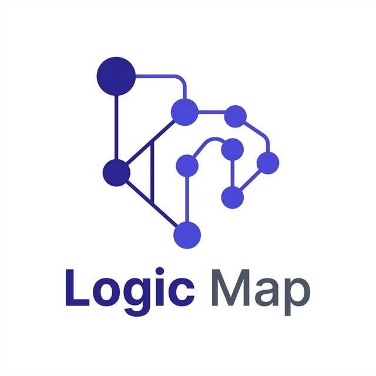

<p align="center">
  
</p>

# Laravel Logic Map

<p align="center">
  <strong>Understand, analyze, and visualize your application's architecture and logic flows.</strong>
</p>

<p align="center">
  <a href="https://packagist.org/packages/dndark/laravel-logic-map"></a>
  <a href="https://github.com/dndark12/laravel-logic-map/actions"></a>
  <a href="LICENSE"></a>
  <a href="https://php.net"></a>
</p>

---

**Laravel Logic Map** leverages deterministic AST analysis via `nikic/php-parser` combined with Laravel runtime metadata to construct an interactive, multi-layered map of your application's logic. Unlike simple dependency graphs, Logic Map visualizes the **functional flow** from Entry Point to Data Persistence.

## 🚀 Key Features

*   **🔍 Holistic Workflow Graph** — Traverse the full execution path: `Route` → `Controller` → `Service` → `Job` → `Model`.
*   **📊 Architecture Metrics** — 7 built-in metrics (In/Out Degree, Fan In/Out, Instability, Coupling, Depth) to detect logic bloat.
*   **🏥 Visual Health Panel** — Real-time health score calculation with grade distribution (A-F) and risk assessment.
*   **🕵️ 5 Specialized Analyzers** — Detect Fat Controllers, Circular Dependencies, Orphan Nodes, High Instability, and Over-coupling.
*   **🌊 Dynamic SubGraph** — Drill down into specific node neighborhoods with adjustable **Depth Traversal (Hops)**.
*   **⌨️ Power-User Shortcuts** — Switch layouts (1-4), toggle themes (T), search (Ctrl+K), and explore modules (M) in milliseconds.
*   **💾 CI/CD Friendly** — Export full graph details to **JSON** or node metrics to **CSV** for automated audits.
*   **🎨 Fully Customizable UI** — Publish and override Blade views, CSS, and JS to match your internal design standards.

---

## 🛠 Installation

```bash
composer require dndark/laravel-logic-map --dev
```

### Publishing Resources

```bash
# Publish base configuration
php artisan vendor:publish --tag=logic-map-config

# RECOMMENDED: Publish ALL resources (Blade, CSS, JS) for full customization
php artisan vendor:publish --tag=logic-map-full
```

---

## ⚡ Quick Start

1.  **Build the Graph:** Scan your project to create a logic snapshot.
    ```bash
    php artisan logic-map:build
    ```

2.  **Explore:** Visit your local dashboard to visualize the findings.
    Visit: `http://your-app.test/logic-map`

---

## ⌨️ Keyboard Shortcuts

| Shortcut | Action |
| :--- | :--- |
| `1` - `4` | **Layouts**: Switch between Flow, Force, Left-to-Right, and Tree. |
| `S` | **SubGraph**: Isolate neighbors of the selected node. |
| `F` | **Fit**: Center and fit the graph to viewport. |
| `T` | **Theme**: Toggle between dark and light modes. |
| `M` | **Modules**: Open/Close the Module Explorer. |
| `Ctrl + K` | **Search**: Instantly focus the node search. |
| `Esc` | **Clear**: Close panels and reset selection. |

---

## ⚙️ Configuration

Control scanning depth and analysis thresholds via `config/logic-map.php`:

```php
'analysis' => [
    'enabled' => true,
    'thresholds' => [
        'fat_controller_fan_out' => 10,
        'high_instability'       => 0.9,
    ],
    'analyzers' => [
        'fat_controller'      => true,
        'circular_dependency' => true,
        'orphan'              => true,
    ],
],
```

---

## 📂 Architecture

Laravel Logic Map consists of two high-performance pipelines:

*   **Build Pipeline**: Scans files using a custom AST parser, calculates structural metrics, and runs the health analyzer. Results are cached as a binary snapshot.
*   **Query Pipeline**: A projection-based API layer that serves graph data to the Cytoscape.js frontend with zero-runtime impact on your main application.

---

## 🤝 Contributing

We welcome contributions! Please see our [Contributing Guide](CONTRIBUTING.md) for details.

## 📄 License

The MIT License (MIT). Please see [License File](LICENSE) for more information.

---
<p align="center">
  Built with ❤️ by <strong>DNDark</strong>
</p>
